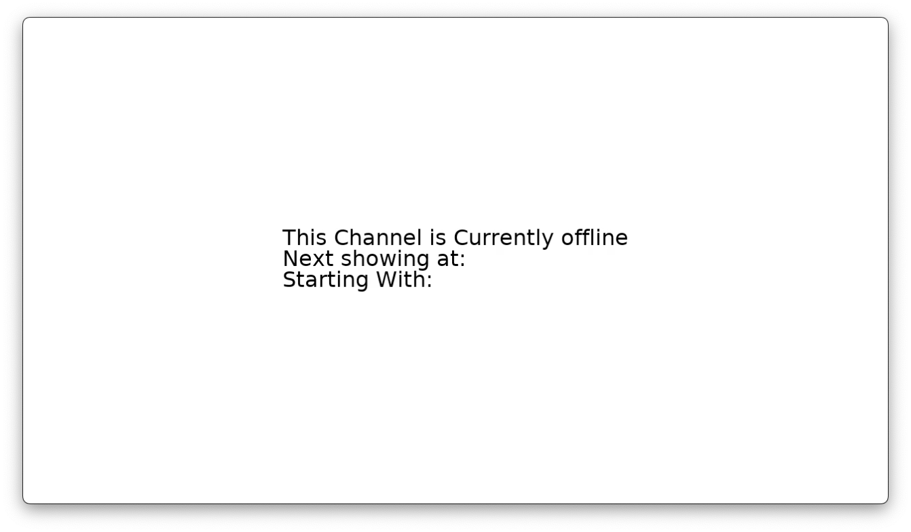

# ErsatzTV-Filler Filler Types and Setup (Channel-Offline)

## What is it?

Channel Offline filler is great for filling in scheduled gaps in your channels, such as overnight when you wont be watching. It includes a message saying that the channel if offline and the start time and name of the next item to play.

## How does it work?

The Channel Offline filler uses the xmltv grabbed from ErsatzTV to find places where it is scheduled to run and uses this information to populate the fields of text that are then displayed.

## How do I set it up?

1. On the first run, a video for each channel will be created. This video will not have any information in it but must be used scheduled in the time when the channel is expected to be offline.

2. If a new channel is added, its video will be created during the next scheduled run or it can be run manually from the web interface or API.

3. For it to work, the time when the channel is expected to be offline must be in 1 item on the schedule and must have a custom title of `Channel-Offline` (this will also appear nicely in any EPG).

4. You will also need to add each `{channelnumber}-offline.mp4` file created automatically to the other videos library and add each one you use to a collection by itself (or with any other things you may want to interweave it with during the offline times, such as short videos, as long as each channel has its own offline collection with only that `channeloffline` video in it or you will see the wrong information on the wrong channel).

5. This collection should then be added to the schedule at times when the channel is planned to be offline (overnight would be a good example). You would then set it for the whole duration of the offline time (duration or flood mode, if the next scheduled item has a fixed start time, would both work). You would then set the `Channel-Offline` custom title and build the playout.

6. You will then see the `Channel-Offline` filler during the offline times as long as there is enough time between when the offline time is set and the offline time starts for at least 1 video generation to occur (this will only apply to the first scheduled offline time as it will automatically search for and build ahead next time).
